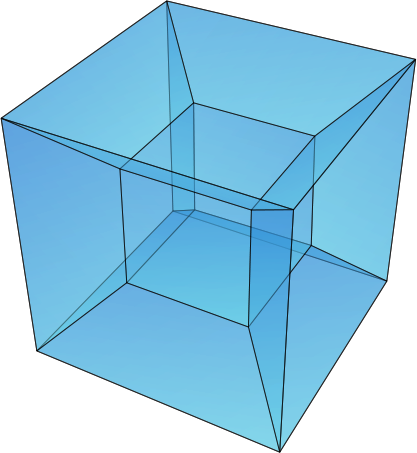

= OCaml-containers =
:toc: macro
:source-highlighter: pygments

What is _containers_? (take a look at the link:TUTORIAL.adoc[tutorial]!
or the http://cedeela.fr/~simon/software/containers[documentation])
In `containers` and `containers.data`, all modules abide by
_pay for what you use_: only modules that are used are linked (there are no
cross-module dependencies).

- A usable, reasonably well-designed library that extends OCaml's standard
  library (in 'src/core/', packaged under `containers` in ocamlfind. Modules
  are totally independent and are prefixed with `CC` (for "containers-core"
  or "companion-cube" because I'm megalomaniac). This part should be
  usable and should work. For instance, `CCList` contains functions and
  lists including safe versions of `map` and `append`. It also
  provides a drop-in replacement to the standard library, in the module
  `Containers` (intended to be opened, replaces some stdlib modules
  with extended ones).
- Several small additional libraries that complement it:

  containers.data:: with additional data structures that don't have an
    equivalent in the standard library;
  containers.io:: (deprecated)
  containers.iter:: with list-like and tree-like iterators;
  containers.string:: (in directory `string`) with
    a few packed modules that deal with strings (Levenshtein distance,
    KMP search algorithm, and a few naive utils). Again, modules are independent
    and sometimes parametric on the string and char types (so they should
    be able to deal with your favorite unicode library).

- A sub-library with complicated abstractions, `containers.advanced` (with
  a LINQ-like query module, batch operations using GADTs, and others).
- Utilities around the `unix` library in `containers.unix` (mainly to spawn
  sub-processes)
- A bigstring module using `bigarray` in `containers.bigarray` (*deprecated*)
- A lightweight S-expression printer and streaming parser in `containers.sexp`

Some of the modules have been moved to their own repository (e.g. `sequence`,
`gen`, `qcheck`) and are on opam for great fun and profit.

image:https://ci.cedeela.fr/buildStatus/icon?job=containers[alt="Build Status", link="http://ci.cedeela.fr/job/containers/"]

toc::[]

== Change Log

See link:CHANGELOG.adoc[this file].

== Finding help

- *new*: http://lists.ocaml.org/listinfo/containers-users[Mailing List]
  the address is mailto:containers-users@lists.ocaml.org[]
- the https://github.com/c-cube/ocaml-containers/wiki[github wiki]
- on IRC, ask `companion_cube` on `#ocaml@freenode.net`
- image:https://badges.gitter.im/Join%20Chat.svg[alt="Gitter", link="https://gitter.im/c-cube/ocaml-containers?utm_source=badge&utm_medium=badge&utm_campaign=pr-badge"]

== Use

Start with the link:TUTORIAL.adoc[tutorial]

You can either build and install the library (see <<build>>), or just copy
files to your own project. The last solution has the benefits that you
don't have additional dependencies nor build complications (and it may enable
more inlining). Since modules have a friendly license and are mostly
independent, both options are easy.

In a toplevel, using ocamlfind:

[source,OCaml]
----
# #use "topfind";;
# #require "containers";;
# CCList.flat_map;;
- : ('a -> 'b list) -> 'a list -> 'b list = <fun>
# open Containers;;  (* optional *)
# List.flat_map ;;
- : ('a -> 'b list) -> 'a list -> 'b list = <fun>
----

If you have comments, requests, or bugfixes, please share them! :-)

== License

This code is free, under the BSD license.

The logo (`media/logo.png`) is
CC-SA3 http://en.wikipedia.org/wiki/File:Hypercube.svg[wikimedia].

== Contents

The library contains a <<core,Core part>> that mostly extends the stdlib
and adds a few very common structures (heap, vector), and sub-libraries
that deal with either more specific things, or require additional dependencies.

Some structural types are used throughout the library:

gen:: `'a gen = unit -> 'a option` is an iterator type. Many combinators
  are defined in the opam library https://github.com/c-cube/gen[gen]
sequence:: `'a sequence = (unit -> 'a) -> unit` is also an iterator type.
  It is easier to define on data structures than `gen`, but it a bit less
  powerful.  The opam library https://github.com/c-cube/sequence[sequence]
  can be used to consume and produce values of this type.
error:: `'a or_error = [`Error of string | `Ok of 'a]` is a error type
  that is used in other libraries, too. The reference module in containers
  is `CCError`.
klist:: `'a klist = unit -> [`Nil | `Cons of 'a * 'a klist]` is a lazy list
  without memoization, used as a persistent iterator. The reference
  module is `CCKList` (in `containers.iter`).
printer:: `'a printer = Format.formatter -> 'a -> unit` is a pretty-printer
  to be used with the standard module `Format`. In particular, in many cases,
  `"foo: %a" Foo.print foo` will type-check.

[[core]]
=== Core Modules (extension of the standard library)

the core library, `containers`, now depends on
https://github.com/mjambon/cppo[cppo] and `base-bytes` (provided
by ocamlfind).

Documentation http://cedeela.fr/~simon/software/containers[here].

- `CCHeap`, a purely functional heap structure
- `CCVector`, a growable array (pure OCaml, no C) with mutability annotations
- `CCList`, functions on lists, including tail-recursive implementations of `map` and `append` and many other things
- `CCArray`, utilities on arrays and slices
- `CCHashtbl`, `CCMap` extensions of the standard modules `Hashtbl` and `Map`
- `CCInt`
- `CCString` (basic string operations)
- `CCPair` (cartesian products)
- `CCOpt` (options, very useful)
- `CCFun` (function combinators)
- `CCBool`
- `CCFloat`
- `CCOrd` (combinators for total orderings)
- `CCRandom` (combinators for random generators)
- `CCPrint` (printing combinators)
- `CCHash` (hashing combinators)
- `CCError` (monadic error handling, very useful)
- `CCIO`, basic utilities for IO (channels, files)
- `CCInt64,` utils for `int64`
- `CCChar`, utils for `char`
- `CCFormat`, pretty-printing utils around `Format`

=== Containers.data

- `CCBitField`, bitfields embedded in integers
- `CCBloom`, a bloom filter
- `CCCache`, memoization caches, LRU, etc.
- `CCFlatHashtbl`, a flat (open-addressing) hashtable functorial implementation
- `CCTrie`, a prefix tree
- `CCHashTrie`, a map where keys are hashed and put in a trie by hash
- `CCMultimap` and `CCMultiset`, functors defining persistent structures
- `CCFQueue`, a purely functional double-ended queue structure
- `CCBV`, mutable bitvectors
- `CCHashSet`, mutable set
- `CCPersistentHashtbl` and `CCPersistentArray`, a semi-persistent array and hashtable
  (similar to https://www.lri.fr/~filliatr/ftp/ocaml/ds/parray.ml.html[persistent arrays])
- `CCMixmap`, `CCMixtbl`, `CCMixset`, containers of universal types (heterogenous containers)
- `CCRingBuffer`, a double-ended queue on top of an array-like structure,
  with batch operations
- `CCIntMap`, map specialized for integer keys based on Patricia Trees,
  with fast merges
- `CCHashconsedSet`, a set structure with sharing of sub-structures
- `CCGraph`, a small collection of graph algorithms
- `CCBitField`, a type-safe implementation of bitfields that fit in `int`
- `CCWBTree`, a weight-balanced tree, implementing a map interface
- `CCRAL`, a random-access list structure, with `O(1)` cons/hd/tl and `O(ln(n))`
  access to elements by their index.
- `CCImmutArray`, immutable interface to arrays

=== Containers.io

*deprecated*, `CCIO` is now a <<core,core>> module. You can still install it and
depend on it but it contains no useful module.

=== Containers.unix

- `CCUnix`, utils for `Unix`

=== Containers.sexp

A small S-expression library.

- `CCSexp`, a small S-expression library

=== Containers.iter

Iterators:

- `CCKList`, a persistent iterator structure (akin to a lazy list, without memoization)
- `CCKTree`, an abstract lazy tree structure

=== String

See http://cedeela.fr/~simon/software/containers/Containers_string[doc].

In the module `Containers_string`:
- `Levenshtein`: edition distance between two strings
- `KMP`: Knuth-Morris-Pratt substring algorithm
- `Parse`: simple parser combinators

=== Advanced

See http://cedeela.fr/~simon/software/containers/Containers_advanced[doc].

In the module `Containers_advanced`:
- `CCLinq`, high-level query language over collections
- `CCCat`, a few categorical structures
- `CCBatch`, to combine operations on collections into one traversal

=== Thread

In the library `containers.thread`, for preemptive system threads:

- `CCFuture`, a set of tools for preemptive threading, including a thread pool,
  monadic futures, and MVars (concurrent boxes)
- `CCLock`, values protected by locks
- `CCSemaphore`, a simple implementation of semaphores
- `CCThread` basic wrappers for `Thread`

=== Misc

The library has moved to https://github.com/c-cube/containers-misc .

=== Others

`containers.lwt` has moved to https://github.com/c-cube/containers-lwt .

[[build]]
== Build

You will need OCaml `>=` 4.00.0.

=== Via opam

The prefered way to install is through http://opam.ocaml.org/[opam].

    $ opam install containers

=== From Sources

On the branch `master` you will need `oasis` to build the library. On the
branch `stable` it is not necessary.

    $ make

To build and run tests (requires `oUnit` and https://github.com/vincent-hugot/iTeML[qtest]):

    $ opam install oUnit qtest
    $ ./configure --enable-tests --enable-unix --enable-bigarray
    $ make test

To build the small benchmarking suite (requires https://github.com/chris00/ocaml-benchmark[benchmark]):

    $ opam install benchmark
    $ make bench
    $ ./benchs.native

== Contributing

PRs on github are welcome (patches by email too, if you prefer so).

A few guidelines:

- no dependencies between basic modules (even just for signatures);
- add `@since` tags for new functions;
- add tests if possible (using `qtest`).

Powered by image:http://oasis.forge.ocamlcore.org/oasis-badge.png[alt="OASIS", style="border: none;", link="http://oasis.forge.ocamlcore.org/"]

== Documentation by version

- http://c-cube.github.io/ocaml-containers/0.17/[0.17]
